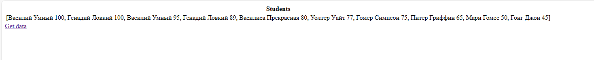

# Домашняя работа 
Получаю уникальные значения из базы данных - по оценкам.  

Данные от БД:  
Логин: admin  
Пароль: admin

Есть файл init.sql - для создания и заполнения базы данных

### Комментарий
Домашнее задание готово, осталось внести небольшие изменения.  

Видимо из-за того, что значения передаются как массив, я не могу перебрать его так как 
для передачи данных пользуюсь EL. Поэтому вывел данные через метод toString. 
Сделал это в том числе и для того, чтобы убедиться в правильности получения данных.  

Пока получаю данные в таком формате: 

